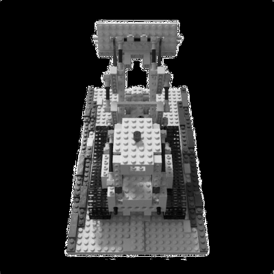
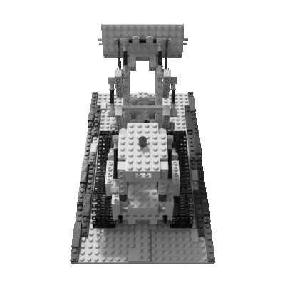

# DE-NeRF
Implemetation of ICCV 2023 Dynamic Event NeRF

## TODO
Sorry for the waiting and after cvpr deadline I will work on this release now
- [x] Upload raw dataset
- [x] Upload the blender file and scripts
- [ ] Upload the code
- [ ] Make this page look nicer :)

## Synthetic dataset
We provide first the dynamic lego dataset we use, you can also use blender to render yourself, just download the blender file from [original nerf](https://drive.google.com/drive/folders/128yBriW1IG_3NJ5Rp7APSTZsJqdJdfc1). Then copy the command from scripts/blender_scipt.py to the blender scripts.

We provide the raw rendering results of dynamic lego and you can download use [link](https://www.polybox.ethz.ch/index.php/s/SoKVORDmZAfCsFX): Note that in this raw data the images are in RGBA format so you can not directly run events simulation on that otherwise you may get results like 
<!-- .  -->

We use depth as mask to get rid of artifacts and get grayscale like 
<!-- .  -->

The implementation code is in scripts/rgba2grayscale.py

We use [ESIM](https://github.com/uzh-rpg/rpg_vid2e) python binding for our experiment, we select esim_torch for faster simulation, you can download the light version which include only rgb and events with [link](https://www.polybox.ethz.ch/index.php/s/Es43yBV30G0xgub) with setting:` --contrast_threshold_neg=0.2 --contrast_threshold_pos=0.2 --refractory_period_ns=0`. The file take
around 600 MB

